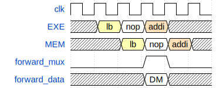
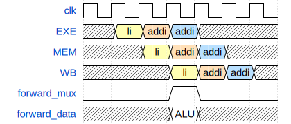
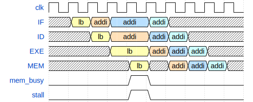
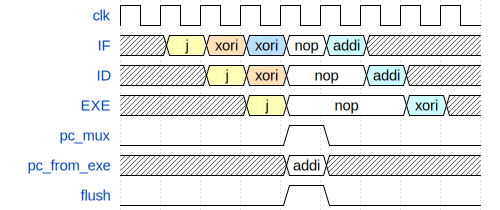
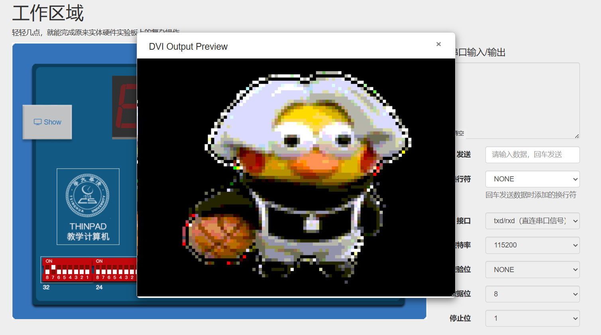

# GROUP26 大实验文档

## 实验目标
在 THINPAD 硬件实验平台上，实现一个支持 RV32I 指令集的流水线 CPU, 支持中断异常、vga、缓存、分支预测


## 设计框图


## 实验内容及效果展示

### Controller

`controller`主要负责控制数据通路和流水线气泡与冲刷

#### 数据通路设计

数据通路主要有以下三条：

##### `ALU@EXE/MEM->ALU`

该数据通路主要解决相邻的、不涉及访存的数据冲突，例如：

```
li t0, 1
addi t1, t0, 1
```


如图，当第二条指令`addi`执行到`EXE`阶段时，`controller`判断`addi`的`rs1, rs2`寄存器与上一条指令`li`的在`EXE/MEM`中间寄存器的`rd`寄存器是否相同。如果相同说明发生数据冲突，此时`forward_mux`置1，`forward_data`置为`li`指令保存在`EXE/MEM`中间寄存器的`alu`计算结果。这些`forward`信号作为`EXE_STAGE`的输入信号

##### `DM@MEM/WB->ALU`

该数据通路主要解决`L`指令造成的数据冲突，例如：

```
lb t0, 0(sp)
addi t1, t0, 1
```



如图，当第二条指令`addi`执行到`EXE`阶段时（此前`lb`指令在流水线插入一个气泡），`controller`判断`addi`的`rs1, rs2`寄存器与上一条指令`lb`的在`EXE/MEM`中间寄存器的`rd`寄存器是否相同。如果相同说明发生数据冲突，此时`forward_mux`置1，`forward_data`置为`lb`指令保存在`MEM/WB`中间寄存器的`DM`访存结果。这些`forward`信号作为`EXE_STAGE`的输入信号

##### `ALU@MEM/WB->ALU`

该数据通路主要解决相隔一条指令的的数据冲突，例如：

```
li t0, 1
addi t2, t1, 1
addi t1, t0, 1
```



如图，当第三条指令`addi`执行到`EXE`阶段时，`controller`判断`addi`的`rs1, rs2`寄存器与第一条指令`li`的在`MEM/WB`中间寄存器的`rd`寄存器是否相同。如果相同说明发生数据冲突，此时`forward_mux`置1，`forward_data`置为`lb`指令保存在`MEM/WB`中间寄存器的`ALU`结果（或`DM`访存结果）。这些`forward`信号作为`EXE_STAGE`的输入信号

#### 流水线气泡与冲刷

流水线需要插入气泡或冲刷主要有两类情况：

##### 结构冲突

当`S`或`L`型指令需要访存时，会和`IF`阶段的读取指令访存冲突。此时`MEM`阶段拉高信号`mem_busy`，`controller`拉高`if_stall`，`id_stall`，`exe_stall`，暂停`IF`，`ID`，`EXE`阶段，等待`MEM`阶段访存完成。例如：

```
lb t0, 0(sp)
addi t1, t0, 1
addi t1, t1, 1
addi t2, t1, 1
```



如图`MEM`阶段执行`lb`指令时，流水线其他阶段保持原状态不变，直到`MEM`访存结束，流水线继续运行。

##### 逻辑冲突

当`EXE`阶段的比较器判断需要执行跳转时，会拉高`pc_mux`信号（信号连接到`IF`和`controller`）。`controller`默认拉高`if_flush`，`id_flush`，冲刷流水线。等待跳转完成，`IF`从新的地址开始执行，例如：

```
    j .next
    xori t0, t0, 1
    xori t1, t0, 1
    ...
next:
    addi t1, t1, 1
    addi t2, t2, 1
```



如图`EXE`阶段`j`指令执行完成，发现需要跳转，此时清空流水线`IF`，`ID`阶段寄存器，同时向`IF`阶段发送`pc_mux`信号和跳转地址`pc_from_exe`。`IF`阶段收到信号后继续执行流水线。 

### 指令缓存

使用直接映射的缓存映射机制。设置64条57位的缓存记录，分别对应1位有效位，24为标志位（32-2-6），以及32位数据位（存储32位指令数据）。具体性能对比见数据缓存部分表格。

### vga

`vga`使用`block memory`作为显存，每个字节中的8位，低2位代表蓝色通道；中间3位代表绿色通道；高3位代表红色通道。通过扫描遍历整个显存确定每个像素点的`RGB`值。



### 分支预测

#### 实现方式

BTB 表采用直接映射的实现方式，表项数量设置为 $64$，每条表项共 $67$ 位，如下图所示：


* $1$ 位有效位；
* $2$ 位 BHT 位；
* $32$ 位记录源 PC 地址；
* $32$ 位记录跳转 PC 地址。

我们通过源 PC 地址的 $[7:2]$ 位确定表项的序号。

加入 BTB 表之后，CPU 结构改动如下：


在 IF 阶段，如果没有收到冲刷指令，则查找 BTB 表，根据 BHT 位选择跳转与否。

而在 EXE 阶段，我们不需要在解析出跳转 PC 地址后便冲刷流水线，而是查找 BTB 表，如果：

* BTB 表中不存在相应表项（有效位为 0），或表项中跳转 PC 地址与当前解析出的地址不同；
* 表项相同，但 BHT 位显示此时 IF 阶段的预测结果与实际结果不一致，

我们才会进行流水线的冲刷。

此外，在 EXE 阶段还要进行 BTB 表的更新。

#### 性能数据对比

如下表所示：

| icache       | BTB          | 1PTB               | 2DCT               | 3CCT               | 4MDCT | CRYPTONIGHT       |
|:------------:|:------------:|:------------------:|:------------------:|:------------------:|:-----:|:-----------------:|
|              |              | -                  | $22.146\textup{s}$ | -                  | -     | $2.328\textup{s}$ |
| $\checkmark$ |              | $28.186\textup{s}$ | $11.073\textup{s}$ | $24.159\textup{s}$ | -     | $1.867\textup{s}$ |
| $\checkmark$ | $\checkmark$ | $13.422\textup{s}$ | $7.382\textup{s}$  | $10.738\textup{s}$ | -     | $1.688\textup{s}$ |

（其中第一行表示只支持基础版本监控程序的 CPU，$-$ 表示测试超时）

### 数据缓存

#### 实现方式

dcache 选择写直达（Write through）加写分配（Write allocate）的策略，并采用直接映射的实现方式，表项数量设置为 $256$，每条表项共 $69$ 位，如下图所示：


* $1$ 位有效位；
* $32$ 位记录主存地址；
* $32$ 位记录主存数据；
* $4$ 位 sel 位。

我们通过主存地址的 $[9:2]$ 位确定表项的序号。

加入 dcache 之后，CPU 在存储数据时同时修改 dcache 和对应的主存内容，在读取数据时首先访问 dcache，未命中时再访问主存。

#### 性能数据对比

如下表所示：

| icache       | BTB          | dcache       | 1PTB               | 2DCT               | 3CCT               | 4MDCT              | CRYPTONIGHT       |
|:------------:|:------------:|:------------:|:------------------:|:------------------:|:------------------:|:------------------:|:-----------------:|
|              |              |              | -                  | $22.146\textup{s}$ | -                  | -                  | $2.328\textup{s}$ |
| $\checkmark$ |              |              | $28.186\textup{s}$ | $11.073\textup{s}$ | $24.159\textup{s}$ | -                  | $1.867\textup{s}$ |
| $\checkmark$ | $\checkmark$ |              | $13.422\textup{s}$ | $7.382\textup{s}$  | $10.738\textup{s}$ | -                  | $1.688\textup{s}$ |
| $\checkmark$ | $\checkmark$ | $\checkmark$ | $13.422\textup{s}$ | $7.382\textup{s}$  | $10.738\textup{s}$ | $29.528\textup{s}$ | $1.688\textup{s}$ |

（其中第一行表示只支持基础版本监控程序的 CPU，$-$ 表示测试超时）

### Flash

#### 实现方式

Flash 采用 16 位模式，每次读取 4 个字节（32 位），Flash 控制器的状态机为：


读取低 16 位数据与高 16 位数据各使用两阶段。

#### 上板实验

* 将一段文本装入 Flash 中：
  
  ```
  Life is tale told by an idiot, full of sound and fury, signifying nothing.
  ```
  
  
  
  

* 在 BaseRAM 中装入测试程序，该程序从 Flash 的起始地址出发，依次读取 200 位的数据并写入串口：
  
  

* 可以看到，串口成功显示 Flash 中装入的文本：
  
  

### 中断异常

#### 实现方式

- CSR寄存器的读写: ID阶段读取, EXE阶段写入(根据当前特权等级写入不同字段)
  `e.g. scrw mtvec, s0  # EXCEPTION_HANDLER`
  

- 异常处理: ID阶段检测异常，等待到MEM阶段进行异常处理，将异常相关信号传递给CSR寄存器（使能、异常原因、异常地址），修改对应CSR寄存器，将当前模式保存到`mstatus_mpp`, 随后冲刷ID、EXE阶段，跳转到异常处理地址; 时钟中断由独立的slave读取, `mtime > mtime_cmp`信号会输出到MEM(用于提供异常pc)与CSR寄存器, CSR寄存器拉高`mip_mtip`字段, 当`mie_mtie`,`mip_mtip`均拉高且当前特权状态为U模式时打开时钟中断; 异常恢复时从mstatus寄存器中恢复特权状态与mie
  `e.g. ecall`
  

#### 上板实验

- 运行kernel内测试程序
  

## 实验心得体会


## 遇到的困难及解决方案


## 思考题
1. 流水线 CPU 设计与多周期 CPU 设计的异同？插入等待周期（气泡）和数据旁路在处理数据冲突的性能上有什么差异。
2. 如何使用 Flash 作为外存，如果要求 CPU 在启动时，能够将存放在 Flash 上固定位置的监控程序读入内存，CPU 应当做什么样的改动？
3. 如何将 DVI 作为系统的输出设备，从而在屏幕上显示文字？


## 分工情况
